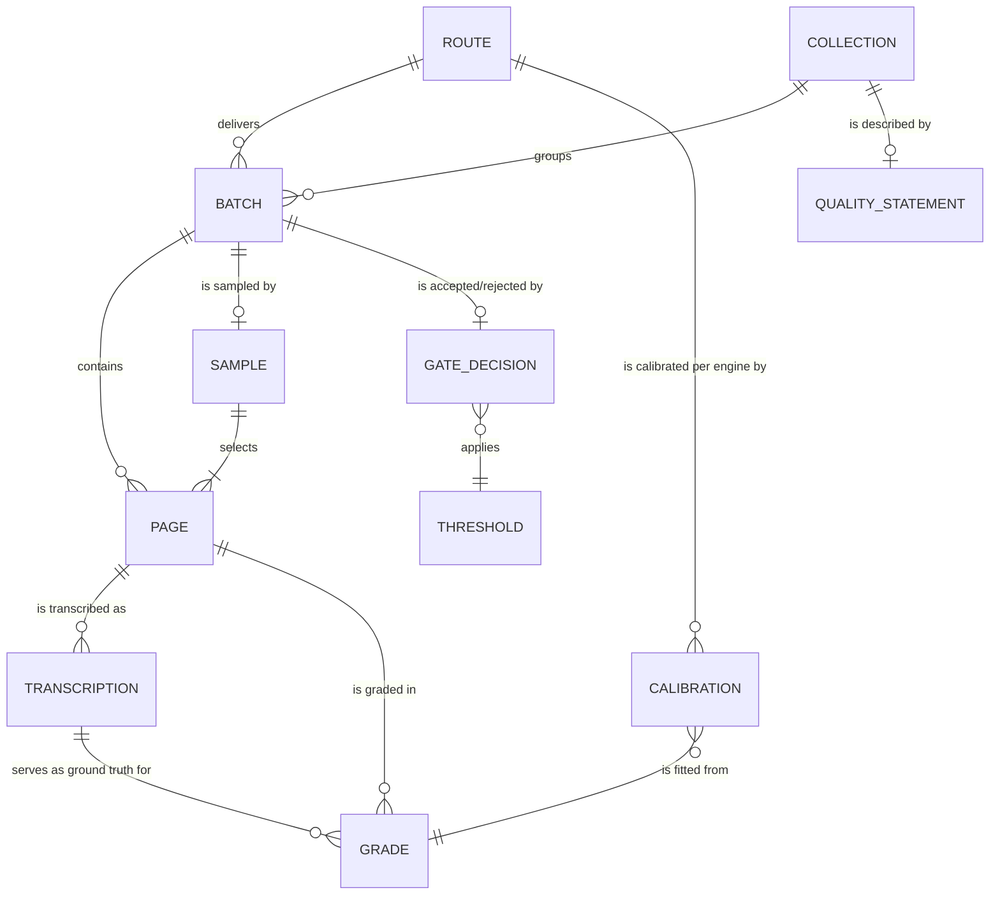

# Layers audit — should the app take more task surface?

**Date:** 2026-07-24 · **Framework:** [Layers of Product Design](https://layers.jamiemill.com) (skills installed at `.claude/skills/layers-*`) · **Question:** whether dpi-eval (desktop/web/CLI) should expand beyond grading into more of the TRIAGE → ESTIMATE → GATE program.

Sources: `docs/findings.md`, `docs/superpowers/2026-07-20-sampling-research-grounding.md`, the "OCR Fitness for Purpose" PDF draft, the workflow gist, and the revision punch list (vault: `inbox/OCR eval write-up — revision punch list.md`).

---

## 1. Orient — decision landscape

| Layer | State | Notes |
|---|---|---|
| Observed behaviour | **Weak** | No student or supervisor has been observed doing the work. Two real observations exist: line-breaks alone doubled CER on one test article (findings §7); Pam sourced dinglehopper via BTAA. Everything else is the team's belief about what students will do. |
| The domain | **Strong** | Tanner/Muñoz/Ros 2009, KB & TCP precedents, acceptance-sampling literature, Title II/WCAG grounding — deep and documented. |
| User needs | **Partial / partly Assumed** | Users named (HDC students; supervisors Pam, Kate, Josh; screen-reader users as beneficiaries) but no job stories. **Dangerous assumption:** that CER/WER proxies accessibility fitness (punch-list #1); what error rates screen-reader users can work with is unknown (#17); whether imperfect OCR counts as an accessible alternative format at all awaits the accessibility office (#2). |
| Product & service strategy | **Partial — the live decision** | Outcome is real (Title II, April 26 2027). One bet already built (grading app). The expansion bets are unmade — this audit's question. |
| Conceptual model | **Weak — the load-bearing gap** | App model: two folders, run, page, score. Program model: route, engine, batch, sample, transcription, threshold, quality statement — modeled nowhere. Vocabulary drift between PDF and gist (#15). |
| Interaction structure | Partial | Solid for the built grading flow (UX pass done); nonexistent for anything new. |
| Surface | Strong (built slice) | WCAG-conscious bands, accessible tables. N/A for new work until lower layers settle. |

**Bottleneck: Observed behaviour.** Lowest weak layer. Every expansion argument ("transcription in a separate editor is the bottleneck", "correction is cheaper than rekeying", "a blocking gate will be bypassed") is an untested belief. **Constraint that changes the calculus:** the two-arm pilot (punch #5) is already the planned response — so the right move is not more research design, but making the pilot serve triple duty: Layer-01 study + strategy experiment + variance data for the sampling design.

**Flagged assumed layer:** user needs — "error rate ≈ accessibility fitness" is load-bearing and unverified. Punch #1's either/or (add reading-order checks, or narrow the claim) is the honest response.

## 2. Product strategy — outcome, opportunities, bets

**Outcome (one, bounded):** By April 26 2027, every collection carries an evidence-backed quality statement saying whether its OCR text serves as an accessible alternative format.

**Opportunities by journey moment** (first-person, problem-space):

- *Preparing a sample* — "I'm handed pages that turn out to be blank or image-only and waste my typing time." (#13)
- *Rekeying* — "I don't know how to type what I see — line breaks, hyphens, ligatures — and my choices change the score." (#12; the doubled-CER observation) · "Retyping whole pages is slow." (#5)
- *Batch decision* — "I can't tell whether this vendor batch is acceptable, and I have a semester deadline." (#9, #10)
- *Backlog triage* — "I have ~48k pages and no idea which are bad." (sampling doc §3)
- *End use* — "As a screen-reader user I can't tell whether this text will read in order." (#1 — served by no current metric)

**Bets:**

| Bet | Serves | Riskiest assumption | Cheapest experiment |
|---|---|---|---|
| **B1 — In-app transcription workbench** (image beside editor, conventions enforced mechanically, one-click grade) | Rekeying moments | ~~That a separate-editor workflow is the bottleneck~~ **Decided 2026-07-24: build it as pilot infrastructure, not as a bet the pilot validates.** External-editor piloting was rejected: unenforced conventions would dirty the pilot's ground truth (the line-break/CER-doubling failure), timing would be stopwatch-grade, and arm-tagging unreliable. Residual risk: the editor's own design is unobserved — treat the pilot as a usability test of the editor and budget a revision after the first two students | Pilot runs inside the editor |
| **B2 — Correct-a-machine-transcript arm** | Rekeying cost | That anchoring doesn't corrupt ground truth | The two-arm pilot itself (#5) — same pages, both arms, compare error patterns |
| **B3 — Program console** (TRIAGE dashboard, GATE decisions) | Batch decision, backlog triage | That defensible thresholds exist | **Not cheaply testable now** — blocked on accessibility-office consultation (#2) and per-engine calibration (#8). Deterministic CLI first (#6); the app renders outcomes later |

**Now / Next / Later:** Now = build the thin transcription editor (sample presentation with blank-page skip, conventions enforced mechanically, arm-tagging, timing capture, one-click grade), then run the two-arm pilot inside it — the pilot remains triple-duty (first behavioral observation, anchoring experiment, variance data) and adds a fourth: usability observation of the editor itself. Next = editor revision from what the pilot shows. Later = console as a *renderer* of deterministic gate/triage outputs, never their home.

## 3. Conceptual model — objects the expansion needs

Noun foraging over the gist + punch list. Instances caught masquerading as objects: the five OCR sources are instances of **Route**; dictionary-rate and engine-confidence are instances of **Signal**.

Key definitions and calls:

- **Transcription** — a rekeyed or corrected page, with `arm` (from-scratch | corrected — B2 requires recording this distinctly, or the anchoring experiment is unanalyzable), `rights` (in-copyright forces the private repo, #11), and a lifecycle: `draft → audited → accepted` (TCP 5% audit; an unaudited transcription must not silently serve as ground truth).
- **Verb precision:** *accept a batch* (gate decision) ≠ *accept a transcription* (audit passed) — never one "Accept". *Rekey* ≠ *correct* — different operations, recorded differently.
- **Grade** — what the app already models (as "run"). Rename toward the program vocabulary when convenient.
- **Provisional (do not build on yet):** `THRESHOLD` and `QUALITY_STATEMENT` (await consultation + calibration); `GATE_DECISION` (deterministic CLI first); `CALIBRATION` per engine-within-route granularity is undecided (#8).
- **Minimum expansion for B1:** the app learns exactly two new objects — **Sample** and **Transcription**. Not batch management, not routes, not thresholds.

## 4. Decisions & open questions

**Decided (this audit):** expand down the student chain (B1/B2); refuse the console until thresholds exist; GT repo is adopted infrastructure (private git), not app surface.

**Decided (Trevor, 2026-07-24):** students do not transcribe or get timed in external apps — data quality and outcomes both suffer. The thin editor is built first, as the pilot's instrument; B1 is no longer gated on prior observation.

**Open:** accessibility-office ruling (#2) · what error rates screen-reader users tolerate (#17) · reading-order/structure checks vs. narrowed claim (#1) · engine-vs-route calibration granularity (#8) · editor design choices, unobserved until the pilot — expect a post-pilot revision.
